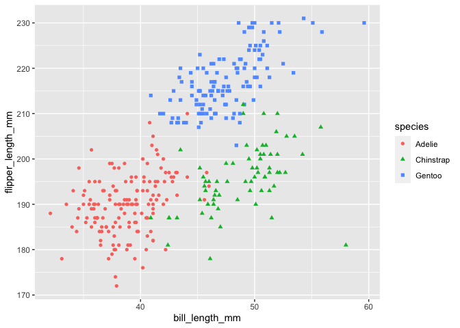

P8105 - Homework 1
================
Chenxi Liu
9/13/2020

``` r
library(tidyverse)
```

# Problem 1

Create a data frame

``` r
problem1_df = tibble(
   vec_numeric = rnorm(10),
   vec_logical = vec_numeric > 0,
   vec_char = c("My", "name", "is", "Chenxi", "I", "like", "doing", "data", "science", "peroid"), 
   vec_factor = factor(c("lv1", "lv1", "lv3", "lv2", "lv1", "lv2", "lv3", "lv2", "lv3", "lv2"))
)
problem1_df
```

    ## # A tibble: 10 x 4
    ##    vec_numeric vec_logical vec_char vec_factor
    ##          <dbl> <lgl>       <chr>    <fct>     
    ##  1      0.556  TRUE        My       lv1       
    ##  2     -0.656  FALSE       name     lv1       
    ##  3     -0.0283 FALSE       is       lv3       
    ##  4      1.55   TRUE        Chenxi   lv2       
    ##  5      1.56   TRUE        I        lv1       
    ##  6      0.697  TRUE        like     lv2       
    ##  7     -1.04   FALSE       doing    lv3       
    ##  8     -0.520  FALSE       data     lv2       
    ##  9     -0.462  FALSE       science  lv3       
    ## 10      0.778  TRUE        peroid   lv2

Try to take the mean of each variable in problem1\_df

``` r
mean(pull(problem1_df, vec_numeric))
```

    ## [1] 0.2445245

``` r
mean(pull(problem1_df, vec_logical))
```

    ## [1] 0.5

``` r
mean(pull(problem1_df, vec_char))
```

    ## [1] NA

``` r
mean(pull(problem1_df, vec_factor))
```

    ## [1] NA

I got numeric result for the numeric and logical factors. I got NA for
character and factor vectors since they are not numeric.

Apply the as.numeric function to the logical, character, and factor
variables.

``` r
as.numeric(pull(problem1_df, vec_logical))
as.numeric(pull(problem1_df, vec_char))
as.numeric(pull(problem1_df, vec_factor))

mean(as.numeric(pull(problem1_df, vec_logical)))
mean(as.numeric(pull(problem1_df, vec_char)))
mean(as.numeric(pull(problem1_df, vec_factor)))
```

The mean for character vector is still NA. The mean for logical vector
is still 0.6. However, each level of factor was intepreted as 1, 2 , 3.
The mean of factor vector become 2.

``` r
as.numeric(pull(problem1_df, vec_logical)) * pull(problem1_df, vec_numeric)
```

    ##  [1] 0.5561240 0.0000000 0.0000000 1.5524689 1.5636430 0.6972857 0.0000000
    ##  [8] 0.0000000 0.0000000 0.7780292

``` r
as.factor(pull(problem1_df, vec_logical)) * pull(problem1_df, vec_numeric)
```

    ##  [1] NA NA NA NA NA NA NA NA NA NA

``` r
as.numeric(as.factor(pull(problem1_df, vec_logical))) * pull(problem1_df, vec_numeric)
```

    ##  [1]  1.11224802 -0.65583467 -0.02828358  3.10493778  3.12728595  1.39457146
    ##  [7] -1.03598284 -0.52038907 -0.46181552  1.55605830

# Problem 2

Load the penguins dataset

``` r
data("penguins", package = "palmerpenguins")
str(penguins)
```

    ## tibble [344 × 8] (S3: tbl_df/tbl/data.frame)
    ##  $ species          : Factor w/ 3 levels "Adelie","Chinstrap",..: 1 1 1 1 1 1 1 1 1 1 ...
    ##  $ island           : Factor w/ 3 levels "Biscoe","Dream",..: 3 3 3 3 3 3 3 3 3 3 ...
    ##  $ bill_length_mm   : num [1:344] 39.1 39.5 40.3 NA 36.7 39.3 38.9 39.2 34.1 42 ...
    ##  $ bill_depth_mm    : num [1:344] 18.7 17.4 18 NA 19.3 20.6 17.8 19.6 18.1 20.2 ...
    ##  $ flipper_length_mm: int [1:344] 181 186 195 NA 193 190 181 195 193 190 ...
    ##  $ body_mass_g      : int [1:344] 3750 3800 3250 NA 3450 3650 3625 4675 3475 4250 ...
    ##  $ sex              : Factor w/ 2 levels "female","male": 2 1 1 NA 1 2 1 2 NA NA ...
    ##  $ year             : int [1:344] 2007 2007 2007 2007 2007 2007 2007 2007 2007 2007 ...

``` r
nrow(penguins)
```

    ## [1] 344

``` r
ncol(penguins)
```

    ## [1] 8

``` r
mean(penguins$flipper_length_mm, na.rm = TRUE)
```

    ## [1] 200.9152

This dataset has variables of species, island, bill\_length\_mm,
bill\_depth\_mm, flipper\_length\_mm, body\_mass\_g, sex and year. It
has 344 rows and 8 columns. The mean flipper length is 200.9mm.

``` r
ggplot(penguins, aes(x = bill_length_mm, y = flipper_length_mm, shape = species, color = species)) + geom_point()
```

    ## Warning: Removed 2 rows containing missing values (geom_point).

<!-- -->

``` r
ggsave("penguins_scatterplots.png")
```

    ## Saving 7 x 5 in image

    ## Warning: Removed 2 rows containing missing values (geom_point).
